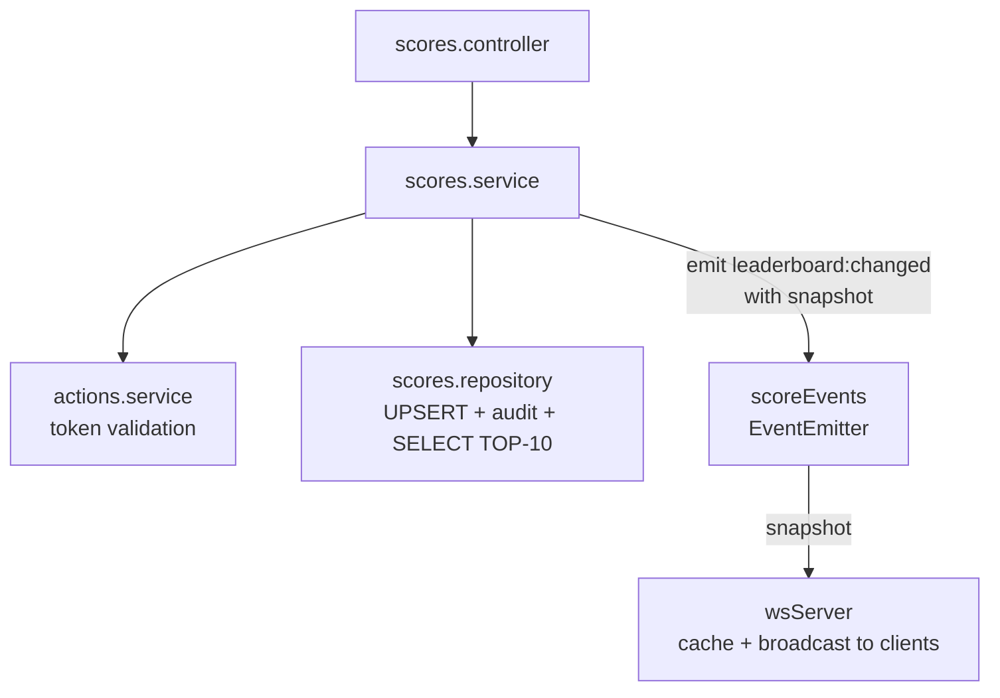
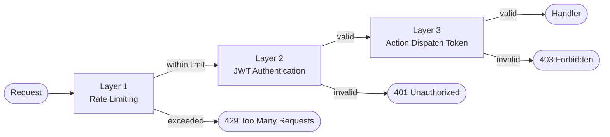
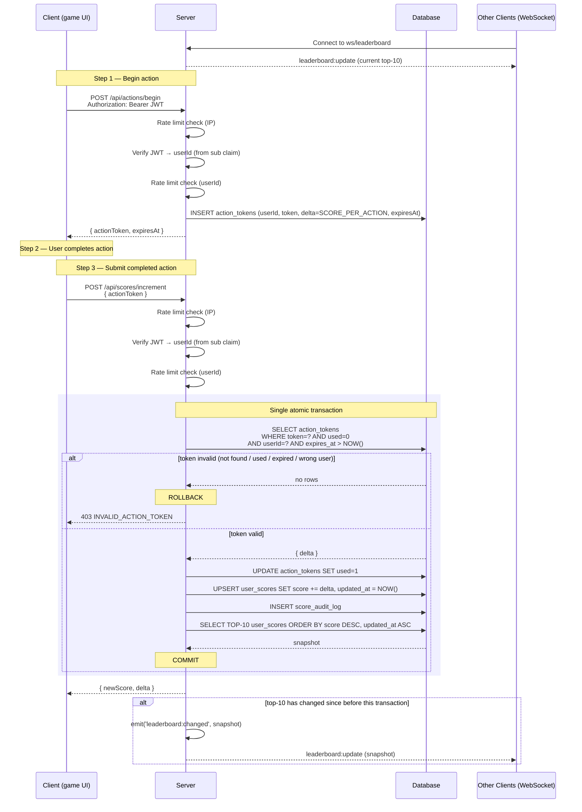

# Problem 6: Scoreboard API Module

Real-time scoreboard API specification for a backend application server.

---

## Overview

The module provides:

- A **live top-10 leaderboard** updated in real time via WebSocket
- A **score increment endpoint** that validates user actions before awarding points
- A **three-layer security model** to prevent unauthorized score manipulation

---

## Stack

| Technology | Purpose |
|---|---|
| Express 5 | HTTP server framework |
| TypeScript 5.x | Type-safe JavaScript |
| better-sqlite3 | SQLite database |
| Zod | Request validation |
| jsonwebtoken | JWT auth |
| ws | WebSocket server |
| express-rate-limit | Rate limiting |

---

## Project Structure

```
src/
├── db/            # SQLite client + schema migrations
├── errors/        # AppError class
├── events/        # scoreEvents — shared EventEmitter for WS broadcast decoupling
├── middleware/    # validate, authenticate (JWT), rateLimit, errorHandler
├── auth/          # Dev-only JWT issuance stub
├── actions/       # Action token minting and validation
├── leaderboard/   # Top-10 read for GET /api/leaderboard HTTP endpoint
├── scores/        # Score increment, audit log, event emission
├── websocket/     # WS server, subscriber to scoreEvents
├── app.ts         # createApp() factory
└── server.ts      # Entry point
```

### Dependency graph



`scores.service` never imports `wsServer` directly. The EventEmitter boundary keeps the service layer free of WebSocket concerns and testable in isolation. `wsServer` holds the last-broadcast snapshot in memory, serving it to new connections and using it as the comparison baseline for broadcast decisions — no separate `leaderboard.service` call is needed.

---

## Security Architecture

### Three-Layer Defence

Rate limiting runs first — before any cryptographic or database work — so abusive traffic is rejected at the lowest possible cost.



**Layer 1 — Rate Limiting:** A global IP-based limiter runs before any auth logic, rejecting clearly abusive traffic without touching JWT verification or the database. Per-user limiters apply after the JWT is verified (userId is needed as the key).

| Limiter | Scope | Limit | Window |
|---|---|---|---|
| Global | Per IP | 200 req | 1 min |
| Score increment | Per `userId` | 10 req | 1 min |
| Action begin | Per `userId` | 20 req | 1 min |

**Layer 2 — JWT Bearer Tokens:** Every score-mutating request requires a signed JWT. The `authenticate` middleware verifies the signature, rejects expired tokens, and attaches `req.user.userId = payload.sub`. The `sub` (subject) claim is the canonical user identifier. No `userId` is ever read from the request body.

In production, JWTs are issued by an upstream identity provider (e.g. an OAuth 2.0 / OIDC service). The dev-only `POST /api/auth/token` stub must be disabled (`NODE_ENV !== 'development'`) before deployment. Both the identity provider and this service share the same `JWT_SECRET` (symmetric) or the service holds the provider's public key (asymmetric RS256).

**Layer 3 — Action Dispatch Tokens:** Before each action the client calls `POST /api/actions/begin`, which mints a server-side single-use token (UUID v4, 5-minute TTL). On action completion the client sends only this token to `POST /api/scores/increment`. The server atomically validates it, marks it consumed, and increments the score in **one transaction**. The client never supplies a score delta — the server resolves the point award from the token row.

### Threat Model

| Attack | Mitigation |
|---|---|
| Score submission without a JWT | `authenticate` rejects with `401` |
| Score submission without completing an action | Server-minted action token required |
| Replay attack | Tokens are single-use; atomically marked consumed |
| Token theft + cross-user reuse | Token's stored `userId` must match JWT `sub` |
| Brute-force token guessing | UUID v4 = 122 bits entropy; per-user rate limit on `/api/scores/increment` (10 req/min) caps enumeration attempts to 10/min per attacker account |
| Token hoarding | 5-minute TTL; rate limit on `/api/actions/begin` |
| Client-supplied score inflation | `delta` baked into token row at mint time; client cannot supply it |

---

## API Endpoints

| Method | Path | Auth | Description |
|---|---|---|---|
| `POST` | `/api/auth/token` | — | Dev stub: issue JWT for a userId |
| `POST` | `/api/actions/begin` | JWT | Mint a single-use action token |
| `POST` | `/api/scores/increment` | JWT | Consume token, increment score |
| `GET` | `/api/leaderboard` | — | Return top-10 scores |

**Response envelope:** all responses use `{ "data": ... }` on success or `{ "error": { "code": "...", "message": "..." } }` on failure.

**CORS:** Restrict `Access-Control-Allow-Origin` to the website's origin (e.g. `https://example.com`). Wildcard `*` must not be used on authenticated endpoints.

---

### POST /api/auth/token

_Development only._ Disabled in production (`NODE_ENV !== 'development'`).

**Request**
```json
{ "userId": "alice" }
```

**Response**
```json
{ "data": { "token": "<jwt>", "expiresIn": 3600 } }
```

| Status | Code | Reason |
|---|---|---|
| 200 | — | JWT issued |
| 400 | `VALIDATION_ERROR` | Missing or invalid `userId` |

---

### POST /api/actions/begin

Mints a single-use action token. Call this immediately before the user starts a score-earning action. No body is required — the server awards a fixed number of points per action (`SCORE_PER_ACTION`) regardless of what the action is.

**Headers:** `Authorization: Bearer <jwt>`

**Response**
```json
{ "data": { "actionToken": "f47ac10b-58cc-4372-a567-0e02b2c3d479", "expiresAt": "2026-04-06T11:05:00.000Z" } }
```

| Status | Code | Reason |
|---|---|---|
| 201 | — | Token minted |
| 401 | `UNAUTHORIZED` | Missing or invalid JWT |
| 429 | `RATE_LIMITED` | Per-user limit exceeded |

---

### POST /api/scores/increment

Atomically validates and consumes the action token, then increments the user's score.

**Headers:** `Authorization: Bearer <jwt>`

**Request**
```json
{ "actionToken": "f47ac10b-58cc-4372-a567-0e02b2c3d479" }
```

**Response**
```json
{ "data": { "userId": "alice", "newScore": 4200, "delta": 100 } }
```

| Status | Code | Reason |
|---|---|---|
| 200 | — | Score incremented |
| 400 | `VALIDATION_ERROR` | Malformed body |
| 401 | `UNAUTHORIZED` | Missing or invalid JWT |
| 403 | `INVALID_ACTION_TOKEN` | Token not found, expired, already used, or userId mismatch |
| 429 | `RATE_LIMITED` | Per-user limit exceeded |

---

### GET /api/leaderboard

Returns the current top-10 scores. Public — no authentication required.

**Response**
```json
{
  "data": [
    { "rank": 1, "userId": "alice",   "score": 98000, "updatedAt": "2026-04-06T10:55:00.000Z" },
    { "rank": 2, "userId": "bob",     "score": 87500, "updatedAt": "2026-04-06T10:53:00.000Z" },
    { "rank": 3, "userId": "charlie", "score": 76200, "updatedAt": "2026-04-06T10:50:00.000Z" }
  ]
}
```

| Status | Code | Reason |
|---|---|---|
| 200 | — | Leaderboard returned |

---

### Error response shape

```json
{ "error": { "code": "INVALID_ACTION_TOKEN", "message": "Token has already been used." } }
```

| Code | HTTP Status | Meaning |
|---|---|---|
| `VALIDATION_ERROR` | 400 | Request body or query failed schema validation |
| `UNAUTHORIZED` | 401 | JWT missing, malformed, or expired |
| `INVALID_ACTION_TOKEN` | 403 | Token not found, expired, used, or userId mismatch |
| `RATE_LIMITED` | 429 | Request rate exceeded for this user or IP |
| `INTERNAL_ERROR` | 500 | Unhandled server error |

---

## Configuration

| Variable | Default | Description |
|---|---|---|
| `PORT` | `3000` | HTTP server port |
| `DB_PATH` | `./data/scores.db` | SQLite database file path |
| `JWT_SECRET` | _(required)_ | Signing secret for JWTs |
| `JWT_EXPIRES_IN` | `3600` | JWT lifetime in seconds |
| `ACTION_TOKEN_TTL_SECONDS` | `300` | Action token lifetime (5 minutes) |
| `SCORE_PER_ACTION` | `100` | Points awarded for each completed action |
| `NODE_ENV` | `development` | Set to `production` to disable the auth stub |
| `CORS_ORIGIN` | _(required)_ | Allowed website origin, e.g. `https://example.com` |
| `WS_PING_INTERVAL_MS` | `30000` | WebSocket keep-alive ping interval |

---

## Getting Started

```bash
# 1. Install dependencies
npm install

# 2. Configure environment
cp .env.example .env
# Required: set JWT_SECRET and CORS_ORIGIN

# 3. Start development server (hot-reload)
npm run dev
# HTTP: http://localhost:3000
# WebSocket: ws://localhost:3000/ws/leaderboard
```

| Script | Description |
|---|---|
| `npm run dev` | Start with hot-reload (tsx watch) |
| `npm run build` | Compile TypeScript to `dist/` |
| `npm start` | Run compiled output |
| `npm test` | Run integration tests (Vitest) |
| `npm run lint` | Lint source files |

---

## Real-time Updates (WebSocket)

**Endpoint:** `GET /ws/leaderboard` (public, no auth required)
Use `wss://` in production — plain `ws://` transmits data unencrypted.

A single event type `leaderboard:update` is used for both the initial snapshot on connection and all subsequent live updates. Clients handle both identically — no need to distinguish between them.

```json
{
  "event": "leaderboard:update",
  "data": [ { "rank": 1, "userId": "alice", "score": 98000, "updatedAt": "..." } ]
}
```

On connection, the server immediately sends the current top-10 as an initial snapshot. After that, the server broadcasts a new snapshot **only when a score increment changes the top-10** — if the scoring user is ranked outside the top 10 and no positions shift, no broadcast is sent. This keeps clients stateless, avoids partial-update edge cases, and avoids unnecessary fan-out on low-ranked score changes.

**Why WebSocket over SSE:** lower latency, broader Node.js ecosystem support. SSE is a valid fallback for environments where WebSocket upgrades are blocked by a proxy (see [Design Decisions](#design-decisions)).

---

## Execution Flow



Token validation and score increment execute in a **single atomic transaction**. If the score write fails, the token is not consumed and the user can retry. The TOP-10 snapshot is read inside the same transaction and passed directly with the event — `wsServer` broadcasts it without a second database query, eliminating a redundant read and any race window between the write and the broadcast.

**Detecting top-10 changes:** `wsServer` keeps the last-broadcast snapshot in memory. After each transaction, `scores.service` emits the new snapshot unconditionally. `wsServer` compares it (by ordered list of `userId + score` pairs) against the cached snapshot and broadcasts only when they differ, then updates the cache. New connections receive the cached snapshot immediately without a database query.

---

## Database Schema

```sql
-- Cumulative score per user
CREATE TABLE user_scores (
  user_id    TEXT    PRIMARY KEY,
  score      INTEGER NOT NULL DEFAULT 0 CHECK(score >= 0),
  updated_at TEXT    NOT NULL DEFAULT (strftime('%Y-%m-%dT%H:%M:%fZ', 'now'))
  -- updated_at must also be set explicitly in the ON CONFLICT DO UPDATE clause;
  -- the DEFAULT only fires on INSERT
);
-- Tie-breaking: equal scores rank by earliest achievement (updated_at ASC)
CREATE INDEX idx_user_scores_score ON user_scores(score DESC, updated_at ASC);

-- Single-use action tokens
CREATE TABLE action_tokens (
  token      TEXT    PRIMARY KEY,             -- UUID v4
  user_id    TEXT    NOT NULL,
  delta      INTEGER NOT NULL CHECK(delta > 0), -- points to award; frozen from SCORE_PER_ACTION at mint time
  expires_at TEXT    NOT NULL,
  used       INTEGER NOT NULL DEFAULT 0        -- 0 = unconsumed, 1 = consumed; never mutated back to 0
);
CREATE INDEX idx_action_tokens_user_id ON action_tokens(user_id);
CREATE INDEX idx_action_tokens_expires ON action_tokens(expires_at);

-- Append-only audit trail
CREATE TABLE score_audit_log (
  id           INTEGER PRIMARY KEY AUTOINCREMENT,
  user_id      TEXT    NOT NULL,
  delta        INTEGER NOT NULL,
  action_token TEXT    NOT NULL,
  score_after  INTEGER NOT NULL,
  created_at   TEXT    NOT NULL
);
CREATE INDEX idx_score_audit_log_user_id ON score_audit_log(user_id);
```

The leaderboard query is `SELECT ... ORDER BY score DESC, updated_at ASC LIMIT 10`. Users with equal scores are ranked by who reached that score first.

---

## Design Decisions

**Fixed score per action, no `actionType`** — the spec states "we do not need to care what the action is." A single `SCORE_PER_ACTION` constant removes the need for the client to declare an action type, eliminates a server-side validation whitelist, and simplifies the API to one field (`actionToken`).

**`delta` frozen at mint time** — `SCORE_PER_ACTION` is read at token mint time and stored in the token row. If the config value changes, in-flight tokens still award the original amount. Users are not penalized or rewarded retroactively by an operator config change during their session.

**EventEmitter for WS decoupling** — `scores.service` emits an event rather than calling `wsServer` directly, keeping the service layer transport-agnostic and easy to test. This also makes the Redis Pub/Sub upgrade path a drop-in replacement.

**Single `leaderboard:update` event** — using two event names (`snapshot` on connect, `update` on change) with identical payloads is unnecessary complexity. One event name means the client handles both cases with the same code path.

**Fixed top-10, no `limit` param** — the spec defines a top-10 board. A variable limit adds complexity without a stated requirement.

**Single transaction for token consumption and score increment** — these two writes must be atomic. If they were in separate transactions and the score write failed after the token was consumed, the user would permanently lose their action reward with no way to retry. One transaction guarantees either both writes succeed or neither does.

**Append-only audit log** — `score_audit_log` is never updated, providing a tamper-evident record for forensic investigation and support disputes.

**SQLite over a distributed store** — sufficient for a single-node deployment. If the service needs to scale horizontally, the `scoreEvents` EventEmitter can be replaced with a Redis Pub/Sub channel and the leaderboard cache replaced with a Redis sorted set — no changes to `scores.service` are required due to the EventEmitter boundary.

**WebSocket over SSE** — chosen for lower latency. If the deployment environment blocks WebSocket upgrades (some proxies and PaaS providers), an SSE endpoint (`GET /api/leaderboard/stream`) is a drop-in alternative; `wsServer` can be replaced with an SSE handler that subscribes to the same `scoreEvents` channel.
